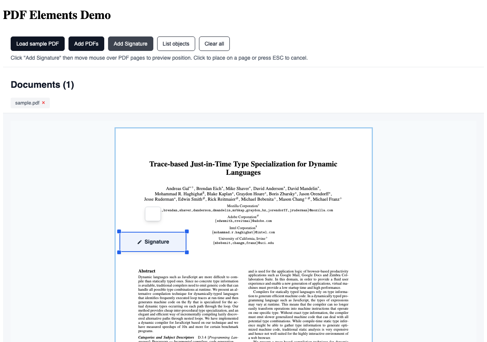

<!--
SPDX-FileCopyrightText: 2026 LibreCode coop and contributors
SPDX-License-Identifier: AGPL-3.0-or-later
-->

# PDF Elements

A Vue 3 PDF viewer for building interactive document workflows with draggable, resizable and fully customizable overlay elements.

Use it to build signature placement, form-field positioning, annotations, review tools, document preparation flows and other PDF experiences where users need to place or manipulate elements on top of a document.

**[Try the live demo](https://libresign.github.io/pdf-elements/)** · [Getting started](docs/GETTING_STARTED.md) · [API](docs/API.md) · [Examples](examples/) · [Contributing](CONTRIBUTING.md)

## Why PDF Elements?

PDF rendering is only part of many document workflows. Applications often also need to let users place, move, resize, inspect or remove interactive elements over PDF pages.

PDF Elements provides that interaction layer as a reusable Vue 3 component.

- **PDF.js-based rendering** for browser PDF viewing
- **Draggable and resizable overlays** positioned directly on PDF pages
- **Custom element types** rendered through Vue slots
- **Interactive placement mode** for adding elements to a document
- **Multiple PDF documents** in the same component
- **Read-only mode** for review and presentation flows
- **Custom action toolbars** for host-application controls
- **Themeable UI** using CSS variables
- **Typed public API** for TypeScript projects

PDF Elements does **not** cryptographically sign or modify the PDF by itself. It focuses on the browser interaction layer, so it can be connected to signing, storage, form or document-processing backends.

## Use cases

PDF Elements can be used for:

- electronic-signature and document-preparation interfaces;
- signature, initials, date or text placement;
- PDF annotation and review tools;
- document form builders;
- approval and document workflows;
- applications that need coordinates and sizing for PDF overlays.

## Documentation

- [Getting started](docs/GETTING_STARTED.md)
- [API reference](docs/API.md)
- [Basic example](examples/basic/)
- [Contributing](CONTRIBUTING.md)
